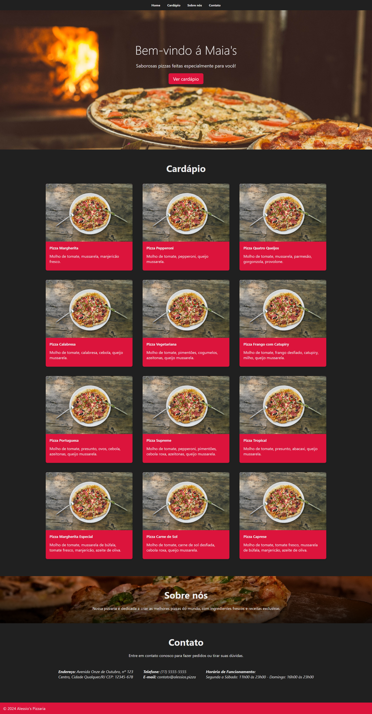
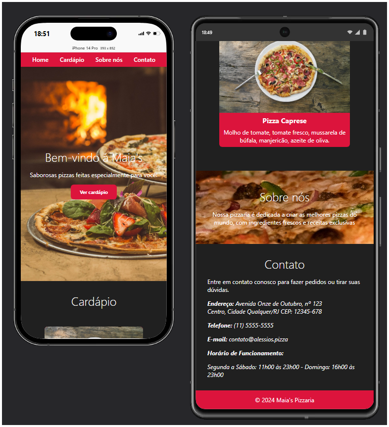

<h1 align="center">Pomo&Chill</h1>

Boost your productivity with Pomo&Chill!

<a href="#project">Project</a>&nbsp;&nbsp;&nbsp;|&nbsp;&nbsp;
<a href="#technologies">Technologies</a>&nbsp;&nbsp;&nbsp;|&nbsp;&nbsp;
<a href="#contact">Contact</a>

[Access Link](https://github.com/maiazip/Maia-s-Pizza)

## Project
A simple yet useful branding website made by me while studying more about modern CSS

## Technologies

- HTML
- CSS